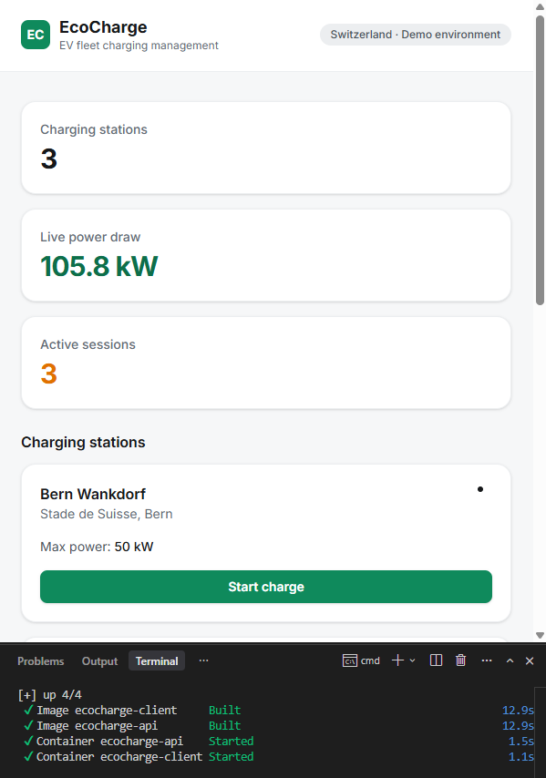
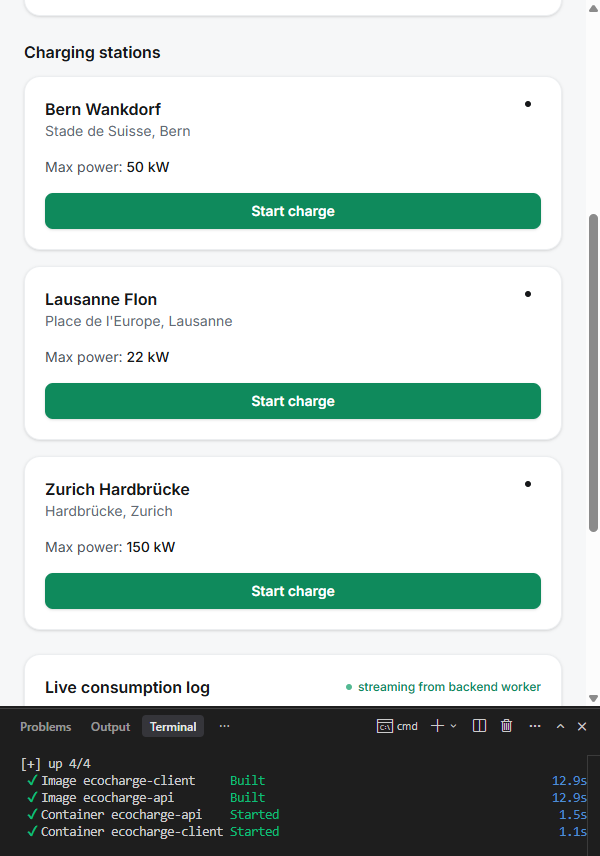
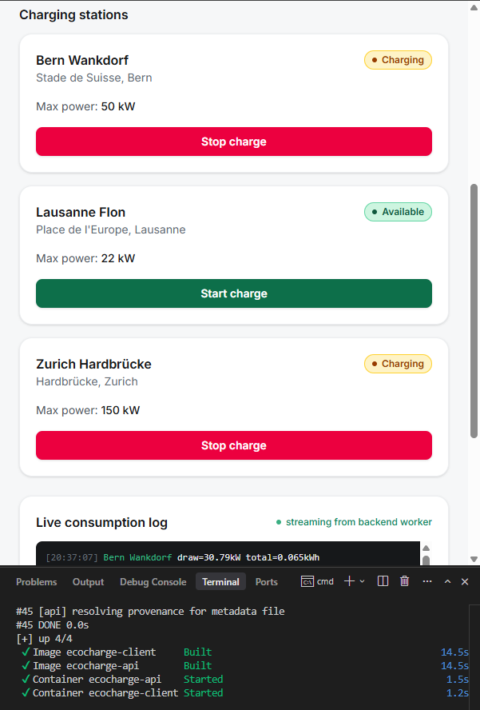
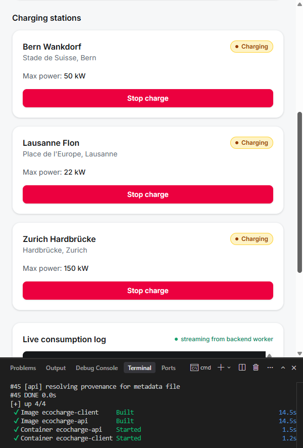
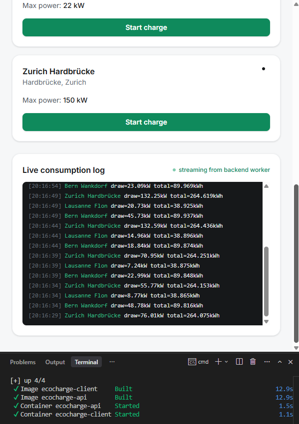
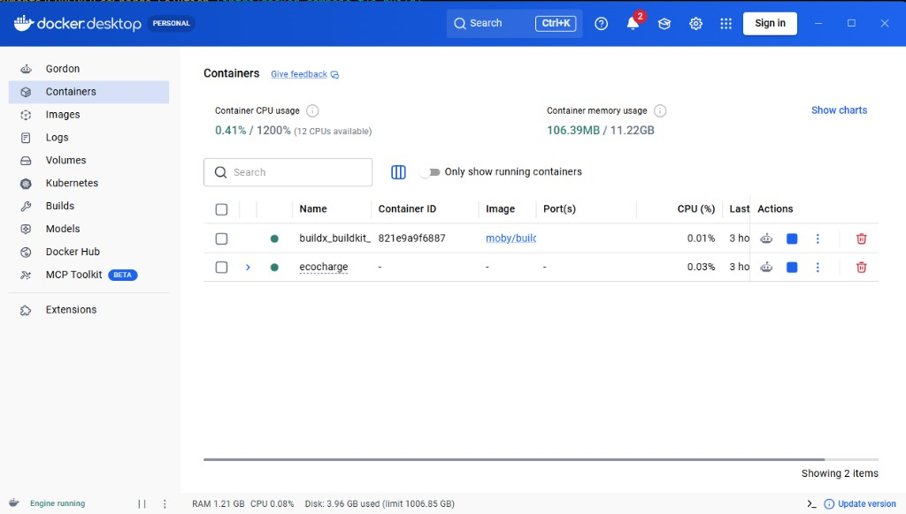

# EcoCharge

EcoCharge is an EV charging station fleet management demo for Swiss fleets.
It tracks stations, live charge sessions, and simulated real-time power
draw. The whole stack — .NET 10 API, SQLite, React dashboard — runs in
Docker. **No native .NET SDK, and no VPS, is required to try it.**

> **Status**: local Docker demo. Clone, `docker compose up --build`, open
> http://localhost:5173. Optional self-hosting is documented in
> [`DEPLOYMENT.md`](./DEPLOYMENT.md) (same Compose file, any Docker host).

## Zero local install, by design

This project deliberately runs its entire backend toolchain through Docker:
no .NET SDK, no local runtime version drift to manage, no extra weight on
your machine. Anyone cloning this repository — a teammate, a recruiter, a
future you on a different laptop — gets a fully working stack with:

```bash
docker compose up --build
```

That's it. The `api` image is built with a multi-stage `Dockerfile`
(SDK for build, slim ASP.NET runtime for execution), so the container
build itself pulls in whatever .NET SDK version is pinned, on demand,
without ever touching the host. The same principle applies to day-to-day
backend development — see [`scripts/dotnet.cmd`](./scripts/dotnet.cmd)
(Windows, cmd.exe), [`scripts/dotnet.sh`](./scripts/dotnet.sh), or
[`scripts/dotnet.ps1`](./scripts/dotnet.ps1). These wrappers run any
`dotnet` command inside the SDK container with the repo mounted, so even
`dotnet test` or `dotnet ef migrations add` never require a native install.

## Architecture

Monorepo containing a Clean Architecture .NET backend and a React frontend.

```
EcoCharge-Solution/
├── src/
│   ├── EcoCharge.Domain/          # Entities, enums, business rules — no dependencies
│   ├── EcoCharge.Application/     # CQRS (MediatR), validation (FluentValidation), repository interfaces
│   ├── EcoCharge.Infrastructure/  # EF Core, repository implementations, background worker
│   └── EcoCharge.Api/             # ASP.NET Core Web API, DI wiring, CORS, error handling
├── tests/
│   └── EcoCharge.Tests/           # xUnit + Moq unit tests
├── EcoCharge.Client/               # React 18+ / TypeScript / Tailwind CSS (Vite)
├── screenshots/                    # Public README gallery (tracked)
├── docker-compose.yml              # Local/self-hosted stack (API + client + optional Postgres)
├── DEPLOYMENT.md                   # Optional: same stack on any Docker host
└── CONTRIBUTING.md                 # Branching / commit conventions
```

### Backend — Clean Architecture + CQRS

- **Domain**: `ChargingStation`, `ChargeSession` entities and `StationStatus`
  enum (`Available`, `Charging`, `Maintenance`), plus invariants such as "a
  charge session cannot start while its station is in `Maintenance`".
- **Application**: one MediatR command/query per use case (e.g.
  `CreateChargingStationCommand`, `StartChargeSessionCommand`,
  `GetChargingStationsQuery`), validated with FluentValidation, depending only
  on repository *interfaces* defined here.
- **Infrastructure**: `ApplicationDbContext` (EF Core), concrete repository
  implementations, and a `BackgroundService` that simulates power draw (kW)
  for active charge sessions every 5 seconds.
- **Api**: `Program.cs` wires up DI, CORS (allowing the client's origin),
  and a global exception-handling middleware returning RFC 7807
  `ProblemDetails` JSON responses.

### Frontend — React + TypeScript + Tailwind

- `components/ui`: small reusable primitives (Button, Badge, Card).
- `features/stations`: KPI banner, station grid/cards, live consumption log.
- `features/dashboard`: composes the above into the main dashboard page.
- `hooks`: `useStations`, `useLiveConsumption` — all data-fetching/polling
  logic isolated from presentation.
- `services`: typed Axios client (`apiClient`, `stationsService`).

## Prerequisites

- **Docker Desktop** — the only hard requirement for the backend (targets
  .NET 10 LTS, supported until 2028-11-14, chosen over .NET 8/9 which both
  reach end of support on 2026-11-10). No local .NET SDK needed.
- Node.js 20+ and npm (tested with Node 24 / npm 11) — only needed if you
  want to run the frontend dev server outside Docker for hot-reload.

## Running locally

### Full stack (recommended — zero install beyond Docker)

```bash
docker compose up --build                      # SQLite by default
docker compose --profile postgres up --build    # with PostgreSQL instead
```

API on http://localhost:5080, client on http://localhost:5173.

On first start with an empty database, the API inserts three demo charging
stations (Lausanne, Bern, Zurich) so the dashboard is not empty. The seed
is skipped as soon as any station already exists.

The API applies pending migrations on startup (`MigrateAsync`). If you still
have a SQLite file created by the older `EnsureCreated` path, delete the
file or the Docker volume once before the first start — see
[`DEPLOYMENT.md`](./DEPLOYMENT.md).

### Frontend only, with hot-reload (faster UI iteration)

```bash
cd EcoCharge.Client
npm install
cp .env.example .env.local   # adjust VITE_API_BASE_URL if needed
npm run dev                  # http://localhost:5173
```

### Backend commands without installing the SDK

```bat
REM Windows — classic cmd.exe (preferred)
scripts\dotnet.cmd restore
scripts\dotnet.cmd test
scripts\dotnet.cmd run --project src/EcoCharge.Api
scripts\dotnet.cmd ef migrations add <Name> --project src/EcoCharge.Infrastructure --startup-project src/EcoCharge.Api --output-dir Persistence/Migrations
```

```bash
# macOS / Linux / WSL
./scripts/dotnet.sh restore
./scripts/dotnet.sh test
./scripts/dotnet.sh run --project src/EcoCharge.Api
./scripts/dotnet.sh ef migrations add <Name> --project src/EcoCharge.Infrastructure --startup-project src/EcoCharge.Api --output-dir Persistence/Migrations
```

## Screenshots

Local Docker demo. Open http://localhost:5173 after `docker compose up --build`.













## Deployment (optional)

The default demo is **local Docker**. The same `docker-compose.yml` runs on
any host that can run Docker (a personal VPS, a spare laptop, CI). There is
no hosted production instance attached to this repository.

See [`DEPLOYMENT.md`](./DEPLOYMENT.md) if you want HTTPS, Nginx, or systemd
in front of Compose. **Nothing is deployed automatically.**

## Contributing / Git workflow

See [`CONTRIBUTING.md`](./CONTRIBUTING.md) for branch naming and commit
message conventions.

## Project status

- [x] Repository initialized, governance docs
- [x] React client scaffolded (Vite + TS + Tailwind), builds successfully
- [x] Backend solution scaffolded (`src/*`, `tests/*`), fully Docker-based
- [x] Domain layer (entities, enums, business rules)
- [x] Application layer (CQRS commands/queries, validation)
- [x] Infrastructure layer (EF Core, repositories, background worker)
- [x] Api layer (endpoints, DI, CORS, error handling)
- [x] Unit tests (xUnit + Moq)
- [x] `docker compose up --build` verified end-to-end (API + client images)
- [x] EF Core initial migration generated (applied on API startup)
- [x] `DEPLOYMENT.md` finalized
- [x] Demo charging stations seeded when the database is empty
- [x] Station cards show Start / Stop from the API status (string enums)
